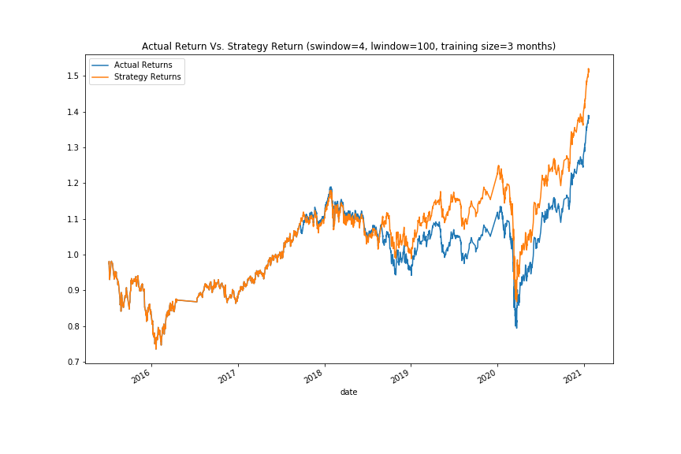
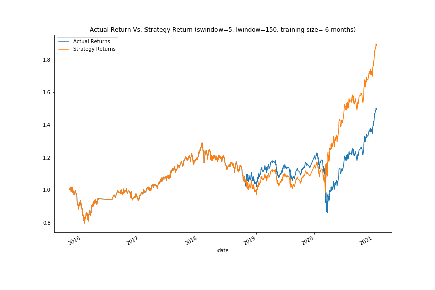

# Machine Learning Trading Bot 

In this assigment, I implenmented an algorithmic trading strategy that uses  SVC model to automate the trade decisions. In order to optimize the trading algorithm, I tuned the input parameters and also trained a new Logistic Regression model. The results are as below:

## Baseline Performance

The baseline trading algorithm has 0.55 accuracy and 0.96 recall score on class 1, but it doesn't work well for profitable short opportunities since its recall score is only 0.04 for class -1. 

## Performance for 6 months training size 

If change the training window to 6 months instead of 3 months, the accuracy slightly increases to 0.56 and the recall score on class 1 increases to 0.98, but the recall score for -1 class decreases to 0.02, which means that this with 6 months training data, this model works better for profitable long opportunities but worse for short opportunities. 

## Performance for different window size 

If set the short window of sma from 4 to 5 , and long window from 100 to 150, the accuracy is 0.56, the recall score on class increases to 0.99, and the recall score on class -1 decreases to 0.01. This model works best if only care about the profitable long opportunities. 

## Performance for Logistics Regression Classifier

The logistics regression model perform better than the baseline model and the tuned trading algorithm for profitable short opportunities regarless its accuracy slightly decreases from 0.55 to 0.54, since the recall score on class -1 increases significantly from 0.04 to 0.23.

Ultimately, which model is best may depend on which class we care about.

